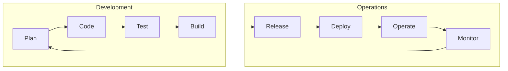

whoami
===

<!-- column_layout: [1, 1] -->

<!-- column: 0 -->
# About me

- Philipp Fruck
- Working as Senior DevOps Engineer

## History
- Studied CS back in 2019
- Continued with M.Sc. Informatik
- Examiner for T2000 since 2023
- Lecturer@DHBW since Oct. 2025

<!-- column: 1 -->
## Philosophy

- Open source advocate
- Linux user 🐧
- What can be automated will be automated!
- CLI > GUI
- Containerization > native installations 

<!-- end_slide -->

What I need to know about you
===

# Experience

- What did you learn in Software Engineering I?
<!-- pause -->
- Do you feel comfortable starting/designing a software project?
<!-- pause -->
- Are you using tooling around software development already?
<!-- pause -->
- How familiar are you with `git`?
<!-- pause -->
- How familiar are you with containers?

<!-- end_slide -->

This lecture...
===

- will be on the practical side
- is created from scratch -> You can help improve its content!
- is graded using a practical assignment

<!-- end_slide -->

Big picture
===

- You know how to code, but do you know to deploy?
- There is more to automate than just running unit tests...
- How do we handle security scans?
  - How do we close vulnerabilities in older versions of our program?

<!-- end_slide -->

You will need...
===

- `git` CLI (GUIs like GitHub Desktop or IDE integrations are not sufficient)
  - On Windows you have two choices:
    1. [git bash](https://gitforwindows.org/)
    2. Windows Subsystem for Linux (WSL) -> recommended
  - MacOS: Install using `brew` or similar
  - Linux: Should be preinstalled, otherwise use your package manager
- Containerization tool (later in the lecture)
  - Podman Desktop recommended for Windows/MacOS
  - On Linux, `podman` CLI is sufficient
- A "git account"
  
<!-- end_slide -->

Account on public git server
===

*https://programmerhumor.io/linux-memes/joke-of-the-year/*

<!-- end_slide -->
Account on public git server
===

- Git can be **decentralized**
- Your project will be git-hosted (public or private) for grading
- Please choose one of the three below

<!-- column_layout: [1, 1, 1] -->

<!-- column: 0 -->

## GitHub

- Biggest public code hoster
- Works.
- Proprietary, kind-of monopoly
- GitHub Actions

<!-- column: 1 -->

## GitLab

- Not as well-known as GitHub
- Less intuitive user interface
- Open source community edition
- GitLab Actions -> More powerful

<!-- column: 2 -->

## Codeberg

- Non-profit, community-led
- Minimalistic user interface
- Completely open source (Forgejo)
- Actions similar to GitHub

<!-- end_slide -->

Thank you for your attention!

Don't forget the feedback
