What is Git
===

- **Distributed version control system**
- Tracks changes to files over time
- Designed for speed, safety, and collaboration

# Why is it relevant

<!-- column_layout: [1, 1] -->

<!-- column: 0 -->

- Track history
- Collaborate safely
- Experiment without fear
- Recover from mistakes

<!-- column: 1 -->

- Industry standard
- Used by open source & enterprises
- Required skill for developers

<!-- end_slide -->

Command Overview
===

| Command      | Description                                      |
| ------------ | ------------------------------------------------ |
| `git init`   | Initializes the repository                       |
| `git branch` | Modifies (`-m`) or deletes (`-d`/`-D`) a branch  |
| `git remote` | Set a remote url, e.g. GitHub, GitLab, etc       |
| `git add`    | Add file contents to the index ("staging area")  |
| `git commit` | Create new commit from index ("staging area")    |
| `git push`   | Push changes to remote repository                |
| `git pull`   | Pull changes from remote repository              |
| `git fetch`  | Fetch updates from remote repository without applying changes |

<!-- end_slide -->

# Commit
<!-- column_layout: [1, 1] -->

<!-- column: 0 -->

A **commit** is a snapshot of the project

- Records file changes
- Has an author and message
- Identified by a hash

<!-- column: 1 -->
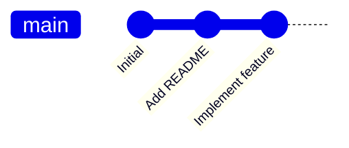

<!-- end_slide -->

# HEAD

**HEAD** points to your current position

- Usually the latest commit on a branch
- Moves when you commit
- Can point to commits directly (detached HEAD)

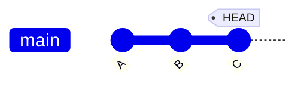

<!-- end_slide -->

# Branch

A **branch** is a movable pointer to a commit

- Represents a line of development
- Cheap and fast
- Encourages experimentation

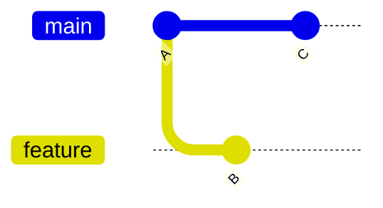

<!-- end_slide -->

# Multiple Branches

Parallel development without interference

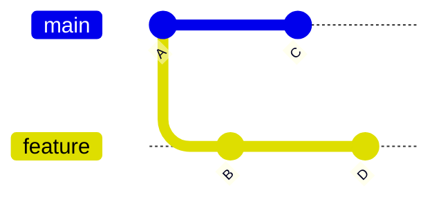

<!-- end_slide -->

# Merging

**Merging** combines branches

- Preserves history
- Creates a merge commit when needed

<!-- end_slide -->

# Fast-Forward Merge

Occurs when no divergence exists

- No merge commit
- Just moves the branch pointer

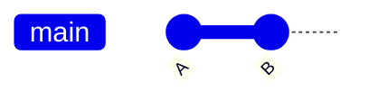

<!-- end_slide -->

# Merge Conflicts

A **merge conflict** happens when Git is unsure

- Same lines changed differently
- Requires manual resolution

<!-- end_slide -->

# Resolving Conflicts

<!-- column_layout: [1, 1] -->

<!-- column: 0 -->

- Git stops the merge
- You edit conflicted files
- Mark resolved
- Commit the result

<!-- column: 1 -->

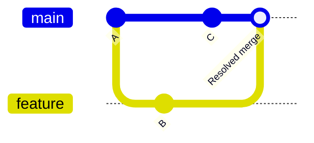

<!-- end_slide -->

# Rebase

<!-- column_layout: [2, 3] -->
<!-- column: 0 -->
**Rebasing** rewrites commit history

- Moves commits onto a new base
- Produces a linear history

<!-- column: 1 -->
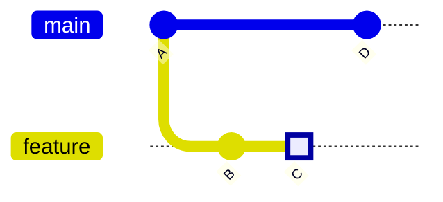

---

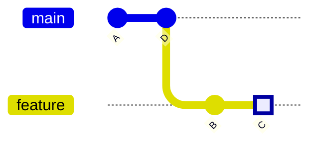

<!-- end_slide -->

# Why Rebase?

<!-- column_layout: [1, 1] -->

<!-- column: 0 -->

- Cleaner history
- Easier to understand
- No unnecessary merge commits

<!-- column: 1 -->

⚠️ Never rebase public/shared branches

<!-- end_slide -->

# Interactive Rebase

Rewrite commits interactively

- Reorder commits
- Edit messages
- Drop commits
- Squash commits

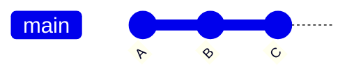

<!-- end_slide -->

# Squashing Commits

**Squashing** combines commits

- Reduces noise
- Creates meaningful history

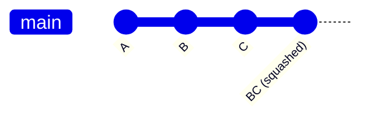

<!-- end_slide -->

# Cherry-Pick

**Cherry-picking** applies a single commit

- Useful for hotfixes
- Avoids full merges

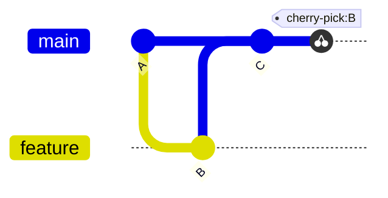

<!-- end_slide -->

# Remote

A **remote** is another repository

- Often shared
- Enables collaboration
- Example: origin

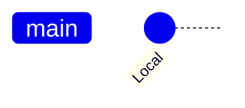

<!-- end_slide -->

# Push and Pull

<!-- column_layout: [1, 1] -->

<!-- column: 0 -->

- `push`: send commits to remote
- `pull`: fetch + merge
- `fetch`: download without merging

<!-- column: 1 -->

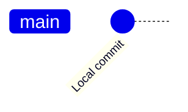

<!-- end_slide -->

# Pull Requests

A **pull request** is a review process

- Discuss changes
- Run tests
- Merge safely

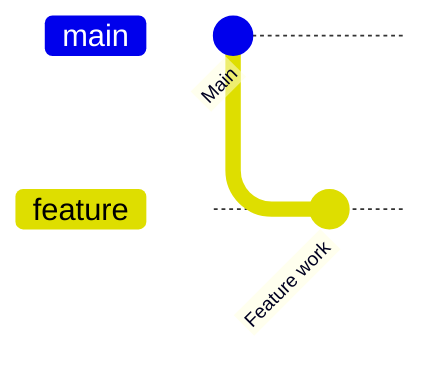

<!-- end_slide -->

# Git is a Graph

Git is fundamentally a **directed, acyclic graph of commits**

- Commits point to parents
- Branches are labels
- History is immutable

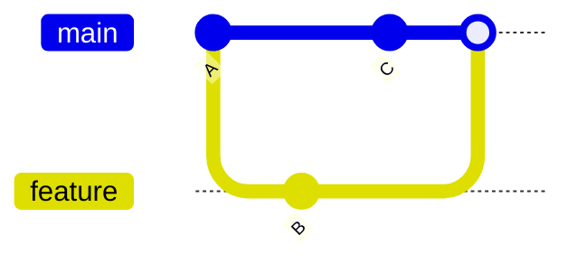

<!-- end_slide -->

# Best Practices

<!-- column_layout: [1, 1] -->

<!-- column: 0 -->

- Commit small changes
- Write clear messages
- Use branches liberally

<!-- column: 1 -->

- Rebase locally
- Merge shared work
- Avoid force-push

<!-- end_slide -->

# Summary

- Git tracks snapshots
- Branches are cheap
- History is powerful
- Understanding the graph is key

<!-- end_slide -->

