Introduction
===

<!-- column_layout: [1, 1] -->

<!-- column: 0 -->
# What is a Version Control System (VCS)

- Version Control: Track different versions in history of a file, e.g. source code
- Version Control System (VCS): Software tool that handles version control 
- Git is not the first and not the last VCS
  - There have been e.g. Mercurial (distributed) and Subversion (centralized)
  - Jujutsu is a modern, git-compatible VCS

<!-- column: 1 -->
# Why should we use a VCS / `git`


- Track history
- Collaborate safely
- Experiment without fear
- Recover from mistakes
- `git`: Industry standard
   - Used by open source & enterprises
   - Mandatory skill for developers

<!-- reset_layout -->

> View Linus Torvalds on git: https://www.youtube.com/watch?v=4XpnKHJAok8
> Transcript: https://git.wiki.kernel.org/index.php/LinusTalk200705Transcript

<!-- end_slide -->

Command Overview
===


| Command       | Description                                                   |
| ------------- | ------------------------------------------------------------- |
| `git init`    | Initializes the repository                                    |
| `git branch`  | Modifies (`-m`) or deletes (`-d`/`-D`) a branch               |
| `git remote`  | Set a remote url, e.g. GitHub, GitLab, etc                    |
| `git add`     | Add file contents to the index ("staging area")               |
| `git commit`  | Create new commit from index ("staging area")                 |
| `git push`    | Push changes to remote repository                             |
| `git pull`    | Pull changes from remote repository                           |
| `git fetch`   | Fetch updates from remote repository without applying changes |
| `git status`  | Show "state" of the repo (changes files, current branch, ...) |
| `git diff`    | Show the current diff (use `--cached` to compare index)       |
| `git restore` | Restore a given diff (use `--staged` to restore index)        |
| `git reset`   | Perform a reset to a given state                              |

<!-- pause -->

Something went wrong? [oshitgit.com](https://ohshitgit.com/)

<!-- end_slide -->

Index
===

# Description

- Git utilizes an index, also called the staging area
- Buffer between the working directory and the repository history
  - Select which changes go into the next commit
  - Commit changes incrementally
  - Temporary snapshot
- Files are added to the index using `git add` and restored using `git restore --staged`

<!-- pause -->

# Gitignore

- To avoid files being added to the index, add them to `.gitignore`
  - Do this for e.g. local dependencies, config (secrets), ...
- Use `/foo` for a top-level file
- Use `foo` to ignore all `foo` files anywhere in the repo
- `.gitignore` files can be located in every subfolder of the repo

<!-- end_slide -->

Stash
===

# Description

Git allows getting rid of changes while saving them for later
- `git stash` saves local changes away
  - Your working directory is clean again
  - Changes are added to an internal stack
- You can show stashed changes using `git stash list`
- Get back stashed changes using `git stash pop` or `git stash apply`

<!-- end_slide -->
Commit
===
<!-- column_layout: [1, 1] -->

<!-- column: 0 -->


# Description

A **commit** is a snapshot of the project

- Records file changes
  - Represented as diff
  - Stores full file contents
- Identified by a hash
- Contains metadata:
  - Author name and email
  - Commit date and time
  - Commit message describing the changes
- Linked to parent commit
  - Forms a Directed Acyclic Graph (DAG)

<!-- column: 1 -->

# Example

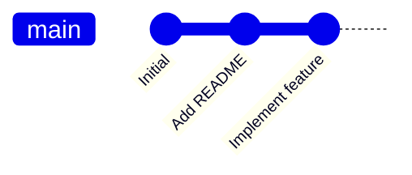

<!-- reset_layout -->
<!-- pause -->

⚠️ Once in git, always in git. Only because you override a commit does not mean its content will disappear. Once pushed to a remote, the commit will remain there even if not referenced by an active branch.

<!-- end_slide -->

HEAD
===

<!-- column_layout: [5, 4] -->

<!-- column: 0 -->

# Description

**HEAD** is a symbolic reference

- Pointer to the current commit "you’re on"
- Moves when you commit
- Usually points to a branch (uses the latest branch commit)
   - Can also point to commits directly (detached HEAD)

<!-- column: 1 -->

# Example

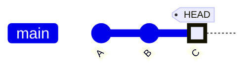

<!-- end_slide -->

Branch
===

<!-- column_layout: [5, 4] -->
<!-- column: 0 -->

# Description

A **branch** is a movable pointer (label/name) to a commit

- Represents a line of development
- Moves forward automatically as you make new commits
- Separates features
  - Encourages experimentation

<!-- column: 1 -->
# Example
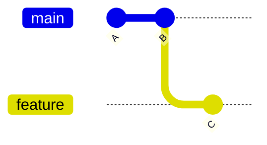

<!-- end_slide -->

Multiple Branches
===

<!-- column_layout: [1, 1] -->
<!-- column: 0 -->
# Description
Parallel development without interference

- Create as many branches as you want
- Work on multiple features simultaneously
- Build on features from colleagues without interfering

Question: How do we reunite?

<!-- column: 1 -->

# Example

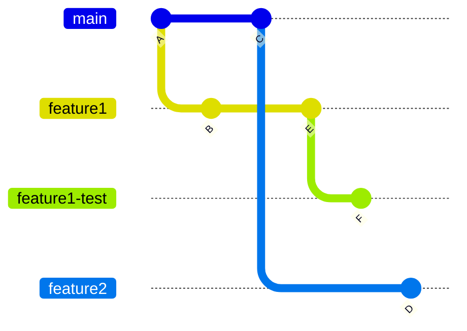

<!-- end_slide -->

Merging
===

<!-- column_layout: [1, 1] -->
<!-- column: 0 -->

# Description
**Merging** combines multiple branches

- Preserves history (no commits are lost)
  - Ordered by original timestamp
- Creates a merge commit
  - Special commit with 2 or more parents
  - Non-linear history
    - Use `git log --graph [--oneline]` to show
    - Easy to use, but suboptimal

<!-- column: 1 -->
## Before merge

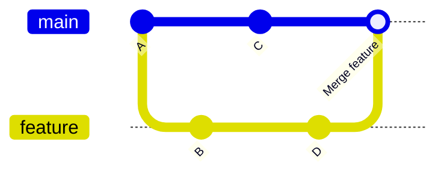
---

## After merge

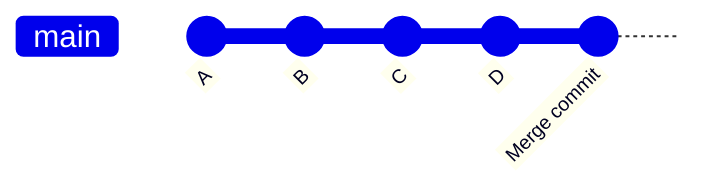

<!-- end_slide -->

Fast-Forward Merge
===

<!-- column_layout: [1, 1] -->
<!-- column: 0 -->

# Description

Occurs when no divergence exists

- No merge commit
- Just moves the branch pointer
  - Linear history remains

<!-- column: 1 -->
## Before merge
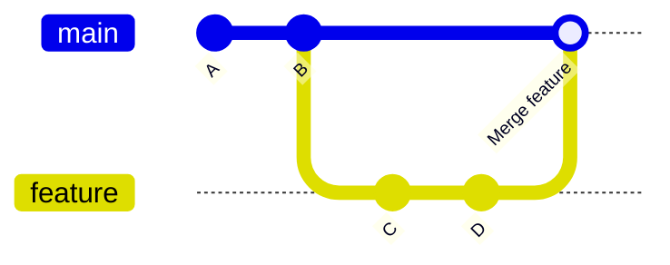

---

## After merge
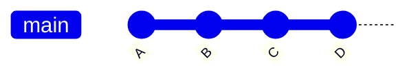
**Note:** No merge commit after **D**


<!-- end_slide -->

Merge Conflicts
===

<!-- column_layout: [1, 1] -->
<!-- column: 0 -->

# Description

A **merge conflict** happens when Git is unsure

- Same lines changed differently
- Requires manual resolution

<!-- column: 1 -->

# Example


<!-- reset_layout -->

<!-- column_layout: [1, 1, 1] -->
<!-- column: 0 -->
```diff
# git show B
--- a/commit
+++ b/commit
@@ -1 +1 @@
-A
+B
```
<!-- column: 1 -->
```diff
# git show C
--- a/commit
+++ b/commit
@@ -1 +1 @@
-A
+C
```
<!-- column: 2 -->
```diff
<<<<<<< HEAD
C
||||||| 5f1bca4
A
=======
B
>>>>>>> feat
```

<!-- end_slide -->

Resolving Conflicts
===

<!-- column_layout: [1, 1] -->

<!-- column: 0 -->
# What happens
- Git stops the merge
- You edit conflicted files
- Mark resolved (`git add`)
- Commit the result
  - Becomes the merge commit

<!-- column: 1 -->
# Example
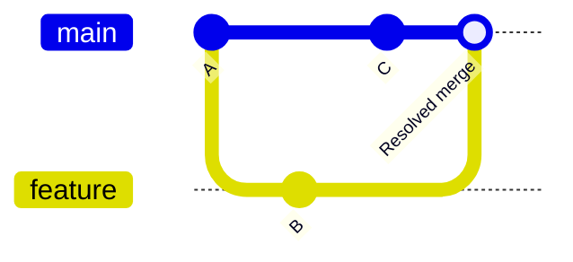

<!-- end_slide -->

Rebase
===

<!-- column_layout: [1, 1] -->
<!-- column: 0 -->

# Description

**Rebasing** moves commits to a new base
- Can be from branch to another
- Or just updating the base branch
- Produces a linear history
  - Keeps same logical order
- Rewrites hashes for new commits
- Replays commits one-by-one
  - Potentially multiple conflicts
  - Solve them like a merge conflict
  - Then `git rebase --continue`
- Hint: `git config rerere.enable true`
  - **re**use **re**corded **re**solution
  - Solve repeating conflicts automatically


<!-- column: 1 -->
# Example

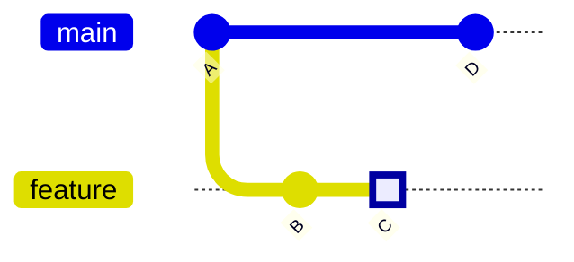

---

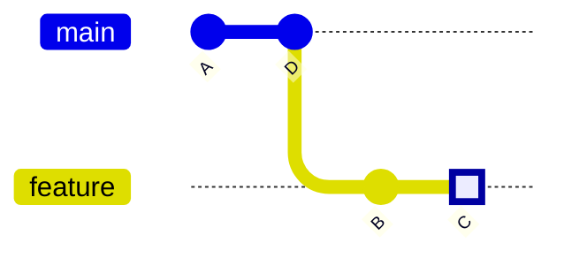

<!-- end_slide -->

Rebase
===

# Why?
- Cleaner history
- Easier to understand
- No unnecessary merge commits

## Recommendations

⚠️ Do not rebase shared branches

⚠️ Use `git push --force-with-lease` for "careful" forced update
- Only forces an update if remote branch has not changed

<!-- end_slide -->

Interactive Rebase
===
<!-- column_layout: [1, 1] -->
<!-- column: 0 -->
# Description
Rewrite commits interactively

- Reorder commits
- Edit messages
- Drop commits
- Squash commits
<!-- column: 1 -->
## Example:

- `git rebase -i A`
  - `A` is the last original commit hash
  - Leave `C` as `pick`
  - Set `B` to `delete` or `d`

<!-- reset_layout -->
<!-- pause -->
<!-- column_layout: [1, 1] -->
<!-- column: 0 -->
## Before rebase

---
## After rebase
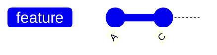
<!-- column: 1 -->
```bash
pick 9124c1b # B
pick 00553b4 # C

# Commands:
# p, pick <commit> = use commit
# r, reword <commit> = use commit, but edit the commit message
# e, edit <commit> = use commit, but stop for amending
# s, squash <commit> = use commit, but meld into previous commit
# d, drop <commit> = remove commit
# [...]
```

<!-- end_slide -->

Squashing Commits
===

<!-- column_layout: [1, 1] -->
<!-- column: 0 -->
# Description

**Squashing** combines commits

- Reduces noise
- Creates meaningful history
- To squash multiple commits, use an interactive rebase
  - e.g. `git rebase -i HEAD~2` to squash the last two commits
  - Leave the first commit as `pick`
  - Set the second to squash
  - Define the commit message for the squashed commit

<!-- column: 1 -->
## Before Squash
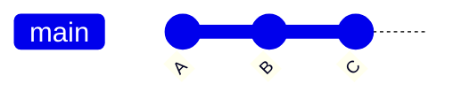
---
## After Squash
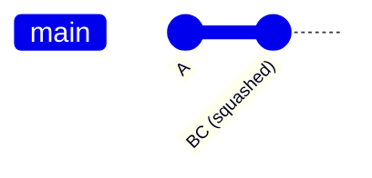

<!-- end_slide -->

Cherry-Pick
===

<!-- column_layout: [1, 1] -->
<!-- column: 0 -->
# Description
**Cherry-picking** applies a single commit

- Useful for hotfixes
- Avoids full merges
- Relevant for backporting
- e.g. `git cherry-pick B`

<!-- column: 1 -->
# Example
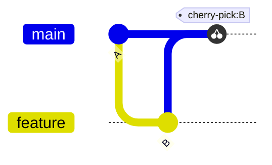

<!-- end_slide -->

Remote
===

<!-- column_layout: [1, 1] -->
<!-- column: 0 -->
# Explanation

A **remote** is another repository

- Often shared
- Enables collaboration
- Example: origin


# Pull Requests

A **pull request** is a review process

- Discuss changes
- Run tests (and more automation)
- Merge safely

<!-- column: 1 -->
# Best Practices

- Use feature branches
- Commit small changes
- Write clear messages
- Avoid force-push (except for rebases)
- Enable branch protection
- Rebase, then squash-merge (personal preference)

# Example
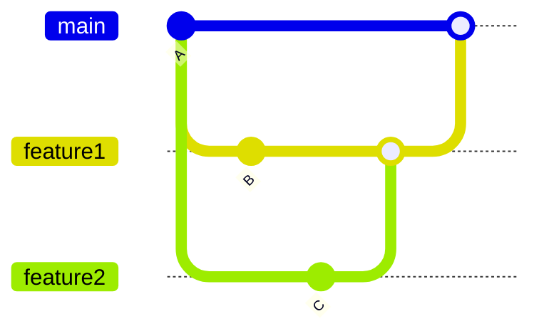
<!-- end_slide -->

Commit Messages
===

- Keep commit messages short and descriptive
  - No "small fixes" -> What did you fix?
- Write a summary on the first line
- More details (if necessary) after one blank line
- Add co-authors after another blank line

```docker
docs: short commit summary in present tense
# |<----  Using a Maximum Of 50 Characters  ---->|

After one blank line, we can start a more detailled message. If you want
to employ a consistent message style, consider conventional commits:
https://www.conventionalcommits.org/en/v1.0.0/
There is also https://gitmoji.dev, but I don't like it personally
# |<----   Try To Limit Each Line to a Maximum Of 72 Characters   ---->|


# Co-authored-by: Author <author@example.com>
```

<!-- end_slide -->

Versioning
===
<!-- column_layout: [1, 1] -->
<!-- column: 0 -->
# Tags

- Tags can be used as an alias to a given commit
- `git tag v1.0.0` marks the current commit as version v1.0.0 of the software
  - Can be used later on to see changes between v1.1.0 and v1.0.0
  - Both diff and commit messages -> Changelog
- Tags can be pushed to the remote via `git push --tags`

<!-- column: 1 -->
# Releases

- There are no "releases" in git
- Releases are a concept of GitHub, GitLab, etc.
- Releases are bound to a tag and can contain additional description, release binaries, etc.
  - Pipelines can be used to create releases from tags
  - We will do this in a later lecture

<!-- end_slide -->

Config
===

There are three types of git configs:

1. System: `git config --system` or `/etc/gitconfig`
2. Global (user): `git config --global` or `~/.gitconfig` / `~/.config/git/config`
3. Local (repo): `git config --local` or `<repo>/.git/config`

Example settings:

<!-- column_layout: [1, 1] -->
<!-- column: 0 -->
## User Config
```yaml
[user]
    email = a.b@c.de
    name = Hacker Man
```
<!-- column: 1 -->
## Convenience Features
```yaml
[branch]
    sort = -committerdate
[rerere]
    enabled = true
```
<!-- reset_layout -->

<!-- pause -->
For more convenient diffs, start using [delta](https://github.com/dandavison/delta)

<!-- end_slide -->

Signing
===

<!-- column_layout: [1, 1] -->
<!-- column: 0 -->
# Impersonation

- In git, you can define your name and email as you want
  - No verification by e.g. GitHub etc
  - Makes it possible to blame other persons for your fault
- Solution: Commit signing
  - Cryptographically proves who created a commit
  - Ensures authenticity and integrity
  - Supports GPG and SSH keys
  - GPG has key expiry and trust levels, but SSH is simpler

<!-- column: 1 -->
```yaml
# GPG example
[user]
    signingkey = ABCDEF1234567890
[commit]
    gpgsign = true
[gpg]
    program = gpg
```

```yaml
# SSH example
[user]
    signingkey = ~/.ssh/id_ed25519.pub
[commit]
    gpgsign = true
[gpg]
    format = ssh
```

<!-- end_slide -->

Config (bonus)
===

If you want to share different git configs amongst multiple projects, consider the following config:

```
# Enable per-folder git config
[includeIf "gitdir:~/dev/personal/"]
  path = config.personal
[includeIf "gitdir:~/dev/work/"]
  path = config.work
[includeIf "gitdir:~/dev/dhbw/"]
  path = config.dhbw
```

<!-- end_slide -->

Git Hooks
===

# Description

Git also has more advanced configuration options that allow automating tasks

- Add files in `.git/hooks/` and make them executable
- Different hooks are called at different times
  - `pre-commit`: Runs before a commit is created
    - Use for linting, formatting, ...
    - Can abort the commit with non-zero exit code
  - `pre-push`: Runs before pushing to a remote
    - Can be used for tests etc.
  - `post-merge` / `post-checkout`: Runs after merging or switching branches
    - Reinstall dependencies, generates files, update $stuff

# Tools

- Tools like [pre-commit](https://pre-commit.com) can be used to run checks before your commit
  - Once configured, add the hook using `pre-commit install` 

<!-- end_slide -->

Git Submodules vs. Subtrees
===

How to include external Git repositories within your project?

# Comparison at a Glance

| Feature | Git Submodules | Git Subtrees |
| :--- | :--- | :--- |
| **Storage** | Pointer to a specific commit | Entire history merged into repo |
| **Workflow** | `git submodule update` required | Standard `git push/pull` |
| **File Size** | Lightweight (metadata only) | Heavier (includes full source) |
| **Visibility** | Clearly separated | Seamlessly integrated |

## Visual Workflow

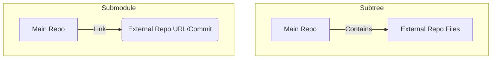

<!-- end_slide -->

Secrets
===

# How do we handle secrets in git?

- Wo don't.
  - Add local secrets to the gitignore as mentioned in the beginning
<!-- pause -->
- But if we have to?
  - This can happen in GitOps workflows
  - Use SOPS (Secrets OPerationS) to do so
    - Supports GPG, age, KMS
    - Encrypt file for multiple users
    - With correct config, git can produce a plaintext diff

⚠️ Recall the definition of cryptographically safe. While breaking the encryption takes an unrealistic amount of time, you should consider only using this in private repos and/or rotating such secrets every no and then :)

<!-- end_slide -->

Thank you for your attention!

Don't forget the feedback
