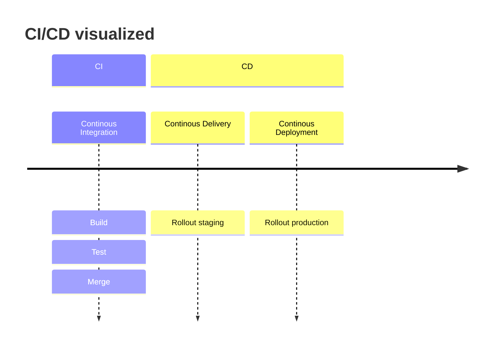
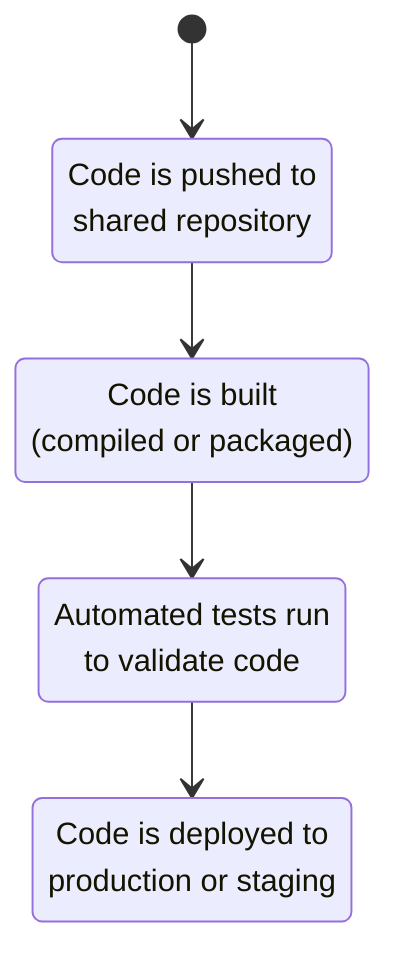

Project structure
===

<!-- column_layout: [1,7,1] -->
<!-- column: 1 -->

# Example

```bash
samplerepo/
├── .git/       # git project folder
├── container/  # container files
├── docs/       # documentation (user, dev, admin)
├── scripts/    # utilities used for development
├── src/        # source folder (depends on language)
├── .prettierrc # config file for tooling
├── CODEOWNERS  # define team responsibilities
├── Justfile    # (or Makefile) script runner
├── README.md   # project overview
└── LICENSE     # open source license,
                # otherwise proprietary
```

<!-- pause -->

## How do I choose a license?

- [Choose a license](https://choosealicense.com)
- [Tabular  Overview](https://choosealicense.com/appendix)
- [Interactive wizard](https://choosingalicense.com/wizard)
- [TLDR Legal](https://tldrlegal.com)

<!-- end_slide -->

Mono vs Multi-Repo
===

<!-- column_layout: [1,1]-->
<!-- column: 0 -->
# Mono-Repo
All components in a single repository

## Pros:

- Unified Versioning
- Cross-Project Changes
- Consistency
- Shared Resources
- Simplified CI/CD

<!-- column: 1 -->

# Multi-Repo

One repo per component

## Pros:

- Separation of Concerns
- Independent Versioning
- Smaller Codebases
- Granular Access Control

<!-- reset_layout -->
<!-- column_layout: [1,1]-->
<!-- column: 0 -->

## Cons:

- Scalability Issues
- Complexity
- Longer Checkout/Clone Times
- Access Control

<!-- column: 1 -->

## Cons:

- Dependency Management
- Cross-Repo Changes
- Integration Overhead
- Tooling Complexity


<!-- end_slide -->

What is CI/CD?
===

<!-- column_layout: [3,4]-->
<!-- column: 0 -->
# Description

CI/CD is a set of practices to automate software development processes, ensuring that code changes are continuously integrated and deployed.

1. **Continuous Integration (CI)**:
  - Automating the frequent integration code into a shared repository
  - Formatting, linting, typechecking
  - Build & test
2. **Continuous Delivery (CD)**:
  - Automatically deploy to testing/staging after CI is passed
3. **Continuous Deployment (also CD)**:
  - Automatically deploy to production

<!-- column: 1 -->


<!-- end_slide -->

Why is CI/CD Useful?
===
CI/CD brings significant benefits to software development teams:
- Faster feedback loops
  - Immediate testing and validation of code
  - No broken code gets merged
- Better code quality
  - Automated testing ensures code works as expected
  - Codebase is always in usable state
- Reduced manual work
  - Automation handles repetitive tasks like deployment
- Enhanced collaboration
  - CI/CD reduces integration issues (wrong styling, bugs, ...)
- Reproducability
  - No "it works on my machine"
  - No handcrafted deployments/manual patches

<!-- end_slide -->

<!-- column_layout: [3,1]-->
<!-- column: 0 -->
How Does CI/CD Work?
===
CI/CD works through the use of **pipelines**:
1. Developers push code to a version control system (e.g., GitHub/GitLab/Codeberg).
2. A **CI pipeline** automatically builds and tests the code.
3. If the tests pass, the code is automatically deployed through a **CD pipeline**.

This process ensures that code is always in a deployable state.

<!-- column: 1 -->


<!-- end_slide -->

CI/CD Examples
===

We take a look at some simple actions for GitHub, Forgejo (Codeberg) and GitLab.

All three action types share the following ideas:

- Actions have different entrypoints
  - Run after git push to certain branch
  - Run for merge requests
  - Schedules execution, e.g. weekly run
- Run on different operating systems or containers
  - E.g. build application on Windows, MacOS and Linux
- Divide into different stages (lint/build/test/deploy)
- Reuse existing snippets (actions/components)
- Create/share artifacts
  - E.g. compiled executable or website
  - Upload release binary or deploy to webserver

<!-- end_slide -->

GitHub Actions: CI/CD Example
===
<!-- column_layout: [3,2]-->
<!-- column: 0 -->
GitHub Actions uses **workflows** defined in `.github/workflows/`

- Each **workflow** can have multiple **jobs**
- A **job** is a set of **steps**
  - Steps are executed sequentally (same runner)
  - Data sharing possible
- By default all jobs run in parallel
  - Dependencies between jobs can be configured
- **Actions** are reusable sets of jobs or code
  - Can be used to checkout code/install tools etc.

[Full syntax](https://docs.github.com/en/actions/reference/workflows-and-actions/workflow-syntax)

<!-- column: 1 -->
```yaml
name: CI/CD Pipeline
on: 
  push:
    branches: [main]
jobs:
  build:
    runs-on: ubuntu-latest
    steps:
      - uses: actions/checkout@v6
      - name: Set up Node.js
        uses: actions/setup-node@v6
        with:
          node-version: '24'
      - name: Install Dependencies
        run: npm ci
      - name: Run Tests
        run: npm test
```

<!-- end_slide -->

GitLab CI/CD Example
===
<!-- column_layout: [3,2]-->
<!-- column: 0 -->
GitLab uses the term **pipelines** for CI/CD.
Pipelines are defined in the `.gitlab-ci.yml`

- Reusable **components** can be used via `include`
- **Jobs** are defined at top-level
- **Jobs** are divided into **stages**
  - Stages are executed sequentially
  - Jobs in a single stage run in parallel
- **Rules** are used to conditionally run a job
- `default` can be used to apply config to all jobs 

[Full syntax](https://docs.gitlab.com/ci/yaml/)

<!-- column: 1 -->
```yaml
include:
  - component: $CI_SERVER_FQDN/my-org/security-components/secret-detection@1.0
stages:
  - build
  - test
build-job:
  stage: build
  image: node
  script:
    - npm ci
test-job:
  stage: test
  script:
    - npm run test
  rules:
    # e.g. only run on main
    - if: $CI_COMMIT_BRANCH == $CI_DEFAULT_BRANCH
```

<!-- end_slide -->

Forgejo CI/CD Example
===
<!-- column_layout: [3,2]-->
<!-- column: 0 -->
Forgejo (Gitea fork) supports CI/CD through **Forgejo Actions**
- Very similar to GitHub Actions
- Actions can be specified using relative or full URL
  - set DEFAULT_ACTIONS_URL as an admin
  - Use full HTTPS URL for custom actions
- For simple pipelines Forgejo and GitHub Actions should be identical
  - But there exist [subtle differences](https://forgejo.org/docs/latest/user/actions/github-actions/)

<!-- column: 1 -->
```yaml
name: Forgejo CI Pipeline
on:
  push:
    branches: 
      - main
jobs:
  build:
    runs-on: ubuntu-latest
    steps:
      - uses: actions/checkout@v6
      - uses: actions/setup-node@v6
        with:
          node-version: '24'
      - name: Install dependencies
        run: npm install
      - name: Run tests
        run: npm test
```

<!-- end_slide -->

Saving Pipeline Data
===

**Artifacts** can be used to save pipelines data (and share it between jobs)

<!-- column_layout: [1,1]-->
<!-- column: 0 -->
# GitHub / Forgejo
```yaml
jobs:
  build:
    steps:
      - run: echo "Hello world" > message.txt
      - name: Upload artifact
        uses: actions/upload-artifact@v4
        with:
          name: my-artifact
          path: message.txt
  consume:
    steps:
      - name: Download artifact
        uses: actions/download-artifact@v4
        with:
          name: my-artifact
      - run: cat message.txt
```

<!-- column: 1 -->
# GitLab

```yaml
stages: [build, consume]
build:
  stage: build
  script:
    - echo "Hello world" > message.txt
  artifacts:
    paths:
      - message.txt
consume:
  stage: consume
  needs:
    - job: build
      artifacts: true
  script:
    - cat message.txt
```

<!-- end_slide -->

Matrix Execution
===

Sometimes we want to parameterize our pipelines:
- Build for multiple CPU architectures
- Test against multiple runtime versions
This can be achieved using a **matrix**

<!-- column_layout: [1,1]-->
<!-- column: 0 -->
# GitHub / Forgejo
```yaml
jobs:
  test:
    runs-on: ubuntu-latest
    strategy:
      matrix:
        node: [22, 24, 25]
    steps:
      - uses: actions/checkout@v4
      - name: Setup Node
        uses: actions/setup-node@v4
        with:
          node-version: ${{ matrix.node }}
      - run: npm ci
      - run: npm test
```
<!-- column: 1 -->
# GitLab
```yaml
test:
  image: node:$NODE_VERSION
  parallel:
    matrix:
      - NODE_VERSION: [22, 24, 25]

  script:
    - npm ci
    - npm test
```

<!-- end_slide -->

CI/CD Best Practices
===
1. **Automate testing**: Ensure every change is tested automatically.
2. **Keep pipelines fast**: Avoid long-running tests to maintain fast feedback.
3. **Deploy often**: Deploy to production regularly for quicker user feedback.
4. **Monitor pipelines**: Keep track of pipeline performance and failures.

<!-- end_slide -->

Exercise
===

Now you have time to run some pipelines yourself!

- Create pipelines to setup, build and test your project
- Consider adding pipelines for tooling (formatting/linting) as well
- If you still have time, try using artifacts and matrices

<!-- end_slide -->

Thank you for your attention!

Don't forget the feedback
