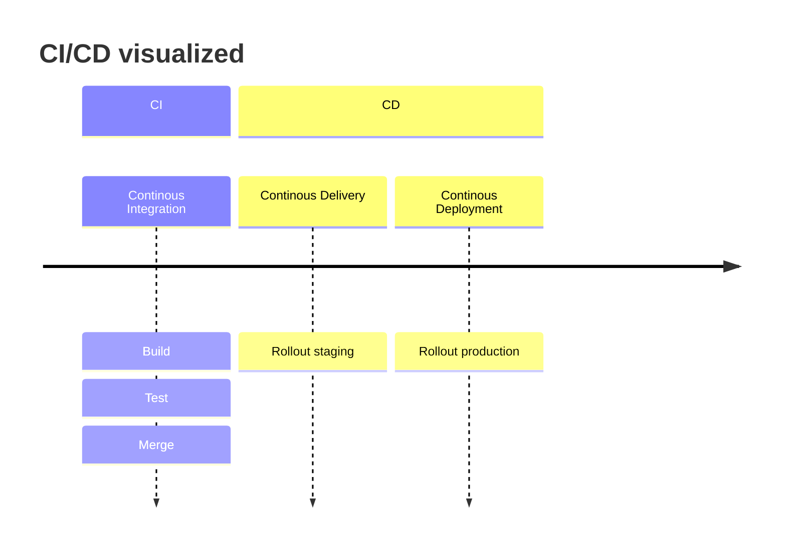
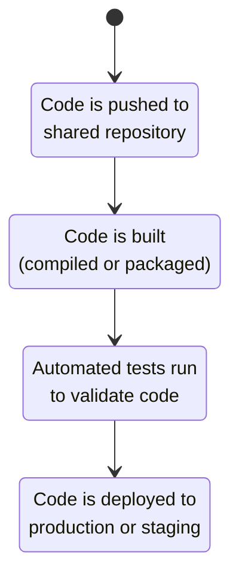

ToDo
===

# General project structure
- src/docs/container
- .github/.gitlab, issue templates
- README/LICENSE
- prettierrc and other tooling config

<!-- end_slide -->

What is CI/CD?
===

<!-- column_layout: [3,4]-->
<!-- column: 0 -->
# Description

CI/CD is a set of practices to automate software development processes, ensuring that code changes are continuously integrated and deployed.

1. **Continuous Integration (CI)**:
  - Automating the frequent integration code into a shared repository
  - Formatting, linting, typechecking
  - Build & test
2. **Continuous Delivery (CD)**:
  - Automatically deploy to testing/staging after CI is passed
3. **Continuous Deployment (also CD)**:
  - Automatically deploy to production

<!-- column: 1 -->


<!-- end_slide -->

Why is CI/CD Useful?
===
CI/CD brings significant benefits to software development teams:
- Faster feedback loops
  - Immediate testing and validation of code
  - No broken code gets merged
- Better code quality
  - Automated testing ensures code works as expected
  - Codebase is always in usable state
- Reduced manual work
  - Automation handles repetitive tasks like deployment
- Enhanced collaboration
  - CI/CD reduces integration issues (wrong styling, bugs, ...)
- Reproducability
  - No "it works on my machine"
  - No handcrafted deployments/manual patches

<!-- end_slide -->

<!-- column_layout: [3,1]-->
<!-- column: 0 -->
How Does CI/CD Work?
===
CI/CD works through the use of **pipelines**:
1. Developers push code to a version control system (e.g., GitHub/GitLab/Codeberg).
2. A **CI pipeline** automatically builds and tests the code.
3. If the tests pass, the code is automatically deployed through a **CD pipeline**.

This process ensures that code is always in a deployable state.

<!-- column: 1 -->


<!-- end_slide -->

CI/CD Examples
===

In the following we take a look at some simple actions for GitHub, Forgejo (Codeberg) and GitLab.

All three action types share the following ideas:

- Actions have different entrypoints
  - Run after git push to certain branch
  - Run for merge requests
  - Schedules execution, e.g. weekly run
- Run on different operating systems or containers
  - E.g. build application on Windows, MacOS and Linux
- Divide into different stages (lint/build/test/deploy)
- Reuse existing snippets (Actions/Components)
- Create/share artifacts
  - E.g. compiled executable or website
  - Upload release binary or deploy to webserver

<!-- end_slide -->

GitHub Actions: CI/CD Example
===
GitHub Actions lets you automate workflows directly from your GitHub repository.

Example Workflow:
- Triggered by a push or pull request to the repository.
- Example `.github/workflows/main.yml`:

```yaml
name: CI/CD Pipeline
on: 
  push:
    branches: [main]

jobs:
  build:
    runs-on: ubuntu-latest
    steps:
      - uses: actions/checkout@v6
      - name: Set up Node.js
        uses: actions/setup-node@v6
        with:
          node-version: '24'
      - name: Install Dependencies
        run: npm install
      - name: Run Tests
        run: npm test
      - name: Deploy
        run: ./deploy.sh
```

<!-- end_slide -->


GitLab CI/CD Example
===
GitLab also supports CI/CD via its integrated CI/CD pipeline.

Example `.gitlab-ci.yml` file:
```yaml
stages:
  - build
  - test
  - deploy

build:
  script:
    - echo "Building project..."

test:
  script:
    - echo "Running tests..."

deploy:
  script:
    - echo "Deploying to production..."
```

GitLab pipelines can be triggered by commits, merge requests, or scheduled events.

<!-- end_slide -->

Forgejo CI/CD Example
===
Forgejo (Gitea fork) supports CI/CD through **Forgejo Actions**, which is very similar to GitHub Actions.

Example Forgejo Action file:
```yaml
name: Forgejo CI Pipeline
on:
  push:
    branches: 
      - main

jobs:
  build:
    runs-on: ubuntu-latest
    steps:
      - uses: https://data.forgejo.org/actions/checkout@v6
      - name: Install dependencies
        run: npm install
      - name: Run tests
        run: npm test
      - name: Deploy to server
        run: ./deploy.sh
```

<!-- end_slide -->

CI/CD Best Practices
===
1. **Automate testing**: Ensure every change is tested automatically.
2. **Keep pipelines fast**: Avoid long-running tests to maintain fast feedback.
3. **Deploy often**: Deploy to production regularly for quicker user feedback.
4. **Monitor pipelines**: Keep track of pipeline performance and failures.

<!-- end_slide -->

Thank you for your attention!

Don't forget the feedback
