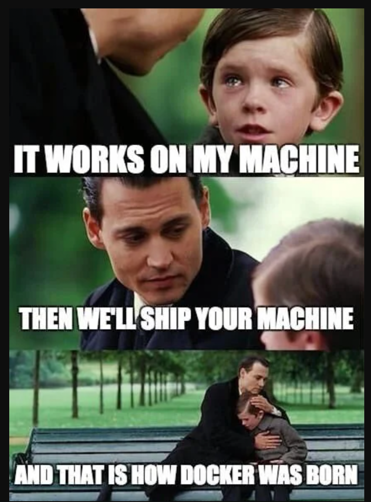
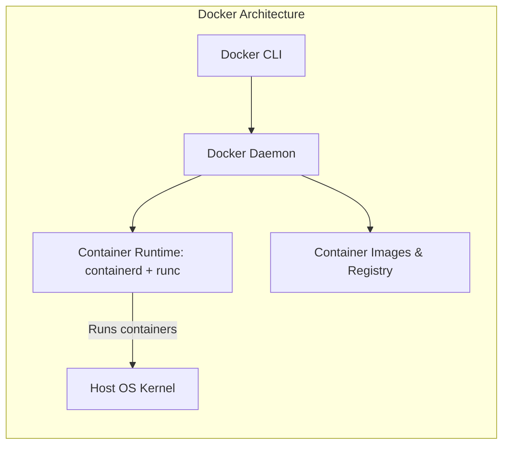
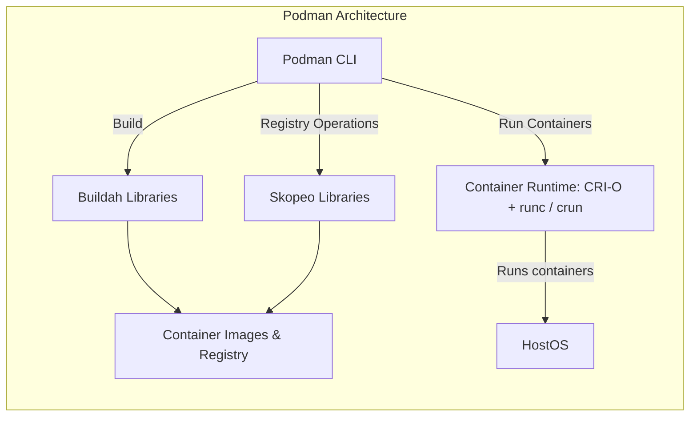

Introduction
===

<!-- column_layout: [1, 1] -->
<!-- column: 0 -->
# What is Containerization?

- Lightweight virtualization method
  - Application or Operating System level
- Isolate applications and their dependencies/runtimes
- Ensure portability across multiple systems
  - Only container runtime is required

<!-- pause -->

## Advantages

- Portability
- Security
- Reproducability

<!-- column: 1 -->




<!-- reset_layout -->

> https://medium.com/nerd-for-tech/docker-in-a-nutshell-but-it-works-on-my-machine-well-then-lets-ship-your-machine-81c6df27ade5
<!-- end_slide -->

Containerization Methods
===

<!-- column_layout: [1, 1] -->
<!-- column: 0 -->

# Kinds of Containers

- LXC/LXD
  - "System containers" that behave like virtual machines
  - Contains full OS including init system (e.g. systemd)
  - Used by e.g. Proxmox and Incus
- Kata Containers
  - Promise: Security of VM, speed of containers
  - Uses one kernel per container
  - Runs inside a micro-VM
  - Integrates with orchestration tools like Docker or Kubernetes
- Open Container Initiative (OCI) Containers
  - Vendor-neutral container standard
  - Defines how image is packaged
  - Defines container lifecycle (create, start, stop)

<!-- column: 1 -->
<!-- pause -->

# This lecture

We will focus on **OCI Containers**

Tools supporting OCI runtime or image specification:

- Runtimes: runc, crun, Kata
  - Lowest level, ensure isolation, start and stop container processes
- Engines: Docker/Podman, containerd, CRI-O
  - User facing interface
  - Utilize runtime to manage containers
  - Provide CLI and API to do so
- Orchestration: Kubernetes (k8s)
  - Schedule containers across multiple machine
  - Scaling, self-healing, rolling updates
<!-- pause -->
- Fun fact: Nix can build OCI images
<!-- pause -->
- Also, systemd (kind of) [can handle OCI](https://fosdem.org/2026/schedule/event/ZKKQWC-native_oci_container_support_in_systemd/)

<!-- end_slide -->
OCI Basics
===

<!-- column_layout: [1, 1] -->
<!-- column: 0 -->
# OCI Image

- OCI image is essentially a tarball
- Consists of multiple "Layers"
  - Layers are stacked changes to the images
- Image contains metadata
  - Entrypoint/Command, Env, Architecture, ...
- `manifest.json` describes how image is stacked together
<!-- pause -->
<!-- column: 1 -->

# Registry
- A registry holds OCI images
- Can be public or private
- Keeps multiple releases of the same image
  - Can perform tasks like vulnerability scanning

<!-- end_slide -->
OCI Basics
===
<!-- column_layout: [1, 1] -->
<!-- column: 0 -->
# OCI Runtime
- Defines container lifecycle
  - start/stop/create/...
- Containers can have entrypoint and command
  - Entrypoint is called with command as arguments
  - Command can be overwritten by user
  - Entrypoint is supposed to be fixed
- Isolated FS, Process and Network namespaces
  - cgroups (CPU/memory/IO)
  - seccomp filters
  - volume mounts

<!-- column: 1 -->
<!-- pause -->
## Container Runtime Interface (CRI) 

- Adds "typical" features not part of the OCI spec
- Logical Volumes
  - Addition to volume mounts
- Pods (group of containers)
  - Only in K8s and Podman, not Docker
  - Shared network namespace/volumes
  - Sometimes shared process namespace
    - By default: Podman shared, K8s unshared
  - Secrets
    - Not really secret, mostly base64 encoded
    - Handle RBAC, not encryption
    - There are additions that encrypt secrets -> Remember e.g. `sops`

<!-- end_slide -->

Docker vs Podman: Summary
===

<!-- column_layout: [1, 8, 1] -->
<!-- column: 1 -->

Comparison of the two major container engines

| Feature      | Docker                   | Podman                        |
| ------------ | ------------------------ | ----------------------------- |
| Architecture | Client/Server            | Daemonless                    |
| Permissions  | Rootfull by default      | Rootless by default           |
| Daemon       | Yes, always running      | Optional (Docker API support) |
| Runtime      | Containerd / runc        | CRI-O / crun                  |
| Pods (k8s)   | Not natively             | Native support                |
| IaC          | docker-compose           | compose, quadlet, k8s         |
| Network      | ⚠️ Overwrites `iptables` | Rootless: Userspace (also has drawbacks) |
|              |                          | Rootfull: ⚠️ Overwrites `iptables` |

<!-- pause -->
In general, Podman can be used as a Docker replacement: `alias docker=podman`
<!-- pause -->
Of course there are differences when comparing rootless against rootfull
<!-- pause -->
This lecture uses Podman as default -> `alias podman=docker` if you have Docker installed

<!-- end_slide -->

Docker vs Podman: Architecture
===

<!-- column_layout: [2, 3] -->
<!-- column: 0 -->

<!-- column: 1 -->

<!-- end_slide -->
Running Containers
===

`podman` and `docker` are interchangieable (for the most part)

`podman run`: Subcommand to run containers

`podman run [--rm] [-it] [--entrypoint <myentrypoint>] [--name mycontainer] myimage <command>`

- `--rm` removes container after run
- `-it` = *i*nteractive with pseudo-*T*TY
- `--name` adds a descriptive name
- `-v`/`--volumes`: Attach volumes or volume mounts: `-v ./my-local-folder:/mnt/folder-in-container:ro,Z`
  - Add `:ro` for read-only volumes, `Z` or `z` for SELinux context
  - SELinux: `container_file_t` label
  - `z` for shared volumes, `Z` if only container is allowed to write
- `--publish, -p=[[ip:][hostPort]:]containerPort[/protocol]`
  - Publish a port, e.g. -p `8080:80` to map 80 in container to 8080 on host

- Network modes: Bridge, Host, none
<!-- pause -->
- ⚠️ Double check your firewall when running in rootfull mode

<!-- end_slide -->
Registries & Tags
===

<!-- column_layout: [1, 1] -->
<!-- column: 0 -->
## Registries

- Implicit container image will resolved to configured registry
- Available registries:
  - DockerHub (docker.io)
  - Quay (quay.io)
  - GitHub Container Registry (ghcr.io)
  - Kubernetes Container Registry (registry.k8s.io)
  - GitLab/Forgejo: Usually same domain as git instance
- Registries can also be written down explicitly
  - Recommended behavior, can still be overwritten by engine config
    - Useful when using custom caching registry

<!-- column: 1 -->
<!-- pause -->
## Tags

- Like git tags, handling depends on project
- Can be `image:tag` or `image@sha256:<shasum>`
- Ideally: Multiple SemVer releases, e.g. version `1.2.3`, `1.2` and `1` refer to the same tag
  - Tags can also contain distros: `python:3.14`, `python:3.14-alpine`, `python:3.14-alpine3.23`
  - Implicit tag is always `latest`. Tags like `latest`, `stable`, `dev`, ... can exist but again depend on project

<!-- pause -->
### Commands

- Use `podman image ls` to show images
- Images can be retagged:
  - `podman image tag <oldtag> <newtag>`

<!-- end_slide -->
Which tag should I use
===

<!-- column_layout: [1, 1] -->
<!-- column: 0 -->
Tag usage always depends on requirements
- Must verify integrity?
  - Pin to shasum
- Must keep stable?
  - Use shasum or explicit tag, e.g. `2.1.0`
- Must auto-update?
  - Use rolling images, e.g. `stable` or `2`
<!-- column: 1 -->

<!-- reset_layout -->
<!-- pause -->
- No silver bullet to solve this problem
- Explicit tags help reproduce older builds
  - Imagine rebuilding a Container from git history one year ago
  - Spoiler: Does not work very often...
- Workaround: Using explicit images & Dependabot/Renovatebot
  - (Auto-)updates always depend on usecase!

<!-- end_slide -->
OCI base images
===

<!-- column_layout: [1, 1] -->
<!-- column: 0 -->
# Base distros

Typical linux distros are available on e.g. Docker Hub
- Debian: `trixie` = `13` = `13.3`
- Ubuntu: `resolute` = `26.04` = `devel`
- Fedora: `43` = `latest`, `44` = `rawhide`
- Archlinux: `latest` = `base`, `base-devel`
<!-- end_slide -->
Building Container Images
===

<!-- column_layout: [1, 1] -->
<!-- column: 0 -->
Now we want to build our own image

- `podman build <context> [-t <tag>] [-f <file>]`
- `Dockerfile` and `Containerfile` are automatically detected by Podman
- Build context (usually .) defines the base directory
  - Files can only be copied from this directory (or subdirs)
  - Add `.dockerignore` for sensible files!
    - Slightly different syntax than gitignore
    - Symlinking might work
<!-- pause -->
- Each directive (`RUN`, `COPY`) creates a new layer
  - Cache is invalidated with first changed layer
Command can be overwritten, e.g:

`podman run --rm -it image /etc/os-release`

<!-- column: 1 -->
```docker
# Indicates start of new image
FROM docker.io/debian:13

# Add a new step inside the layer, e.g. to install
# a package, then clean up (reduce size)
RUN apt-get update && apt-get install nano \
  && rm -rf /var/lib/apt/lists/*

# Change the workdir (create directory)
WORKDIR /myworkdir

# Copy a file from the host
COPY example.txt .

# Use command or shell notation
ENTRYPOINT ["nano"]
CMD ["example.txt"] 
```

<!-- end_slide -->
Exercise
===

Your task is to create two simple container images, one running hello world both in C and Python:

<!-- column_layout: [1, 1] -->
<!-- column: 0 -->
# Python

- Create a file `hello_world.py`
- Use a simple Python image to run the file
  - You don't need to build an image, just modify the volume mount and command

<!-- column: 1 -->
# C

- Create `hello_world.c` and a second Containerfile
- Start with a debian image (docker.io/debian:slim)
- Install the build tools
- Compile the C file and run it
- Does it work?

<!-- pause -->
- Do you think this is a good solution?
<!-- pause -->
  - No! We want to reduce the overhead!

<!-- end_slide -->
OCI base images
===

<!-- column_layout: [1, 1] -->
<!-- column: 0 -->
# Base distros

Typical linux distros are available on e.g. Docker Hub
- Debian: `trixie` = `13` = `13.3`
- Ubuntu: `resolute` = `26.04` = `devel`
- Fedora: `43` = `latest`, `44` = `rawhide`
- Archlinux: `latest` = `base`, `base-devel`

<!-- pause -->
Bloat!
- Developers use them because they are lazy
- Images contain a lot of overhead
- Good for development / PoC
- Bad for production (minimizing attack surface)

<!-- column: 1 -->
<!-- pause -->
# More minimal distro
- `debian:slim` (more minimal Debian)
- alpine (minimal distro with busybox and musl instead of coreutils and glibc)

<!-- pause -->
They still contain shell and other "useless" stuff

## Peak minimalism

- distroless
  - Developed by Google
  - Only application & shared libs
  - Minimal OS files
  - No shell/package manager
- scratch
  - Empty filesystem
  - Meta image (built-in, no registry required)

<!-- reset_layout -->
<!-- pause -->
- Scratch is not always the answer. Sometimes we need tools like shell, cat, ...
- Benchmarks indicate that images without `glibc` might perform worse!
<!-- end_slide -->

Multi staging
===

<!-- column_layout: [1, 1] -->
<!-- column: 0 -->
Idea: Fewer stuff in image
- Each `FROM` directive starts a new image
  - Last `FROM` directive (or target) specifies the image to build
  - Other images are stored as temporary artifacts
- Build dependencies are not shipped to prod image
  - Ensure that all required libraries are present on target image
  - Requires static compilation
- Default: Build last target in image
  - Run `podman build --target builder` to build the first layer explicitly
  - Useful to have prod and dev image in same Containerfile

<!-- column: 1 -->

```docker
# Stage 1: build
FROM docker.io/debian as builder
RUN apt-get update &&\
    apt-get install gcc libc6-dev
WORKDIR /src
COPY hello_world.c .
RUN gcc -static -O2 -s hello_world.c -o hello_world

# Stage 2: prod
FROM scratch as prod
COPY --from=builder /src/hello_world /hello
ENTRYPOINT ["/hello"]
```
<!-- end_slide -->
Building Container Images - Advanced
===

<!-- column_layout: [3, 2] -->
<!-- column: 0 -->
- `COPY` can also be run with `--chown user:group` and `--chmod 640`
  - Works different than `cp` command on directories
  - `COPY ./src/ .` copies the content of `src` to `.`
<!-- pause -->
- `ENV` can be used to persist environment variables
- `EXPOSE` can be used to highlight ports
  - e.g. `EXPOSE 443/tcp` for a webserver
  - Only metadata, does not actually forward a port
<!-- pause -->
- `ARG` can be used to add build-time argument
- `ARG`s are reset per stage (after each `FROM`)
  - Just declare them again, they keep their value
  - Use `--build-arg <key>=<value>` to add arguments to the build

<!-- column: 1 -->
```docker
# specify arg with default
ARG DEBIAN_VERSION=13
# use base image version
FROM debian:${DEBIAN_VERSION}
# ensure reuse of ARG
ARG DEBIAN_VERSION
# move ARG to ENV
ENV DEBIAN_VERSION=${DEBIAN_VERSION}
# finally consume build arg
CMD echo $DEBIAN_VERSION
```
<!-- end_slide -->
Container image: Reducing Privileges
===

Now we know how to build smaller images - But how to restrict permissions?

- Switch to a different user/group
  - `USER <user>[:<group>]`: `useradd` must be used to create new user
<!-- pause -->
  - `USER UID[:<GID>]`: User must not exist, only UID/GID are assigned
    - Can also be accomplished at runtime: `podman run --user <uid>[:<gid>]`
<!-- pause -->
But: I am running rootless Podman... Why do I have a root user at all?
- Rootless mode uses subuid mapping
  - `/etc/sub{u,g}id` contains mapped user-id address space
  - `myuser:524288:65536`: 2**16 subuids starting with 524288
  - `root` in container is `myuser` on the host
  - Other user in container becomes subuid, e.g. `1` in container is `524288` on the host
<!-- pause -->
- But... I cannot access files created by `524288`
  - You need to access the subuid space ("unshare")
  - `podman unshare id` -> `uid=0(root) gid=0(root)`
  - `podman unshare` is like `sudo` for the subuid range
<!-- pause -->
<!-- column_layout: [1, 1] -->
<!-- column: 0 -->
- Can podman resolve permission issues for me?
  - Volume options `idmap=auto` or `idmap=keep-id`
  - Or `podman run --userns=keep-id`
<!-- column: 1 -->
- As always, keep privileges to a minimum. `--userns=keep-id` is kind of equal to running root inside the container.

<!-- end_slide -->
Further Topics
===

# OCI Image Authenticity

- We talked about integrity of images, but can we also verify trusted publishers of images?
<!-- pause -->
- We can use image signing, e.g. using [Cosign](https://github.com/sigstore/cosign)
  - Verify image against public key
  - Podman (and registries like goharbor) can reject pulling unverified images

<!-- pause -->
# Capabilities

I need to run rootless inside the container, but I want to utilize the `ip` command

- You will need to add the `NET_ADMIN` capability to your container
- Actually, `ip` is an edge case and drops all non-inherited capabilities
- Capabilities can be added to the container sandbox
  - They can also be set during image build (using `setcap` as root)

<!-- end_slide -->

Thank you for your attention!

Don't forget the feedback
