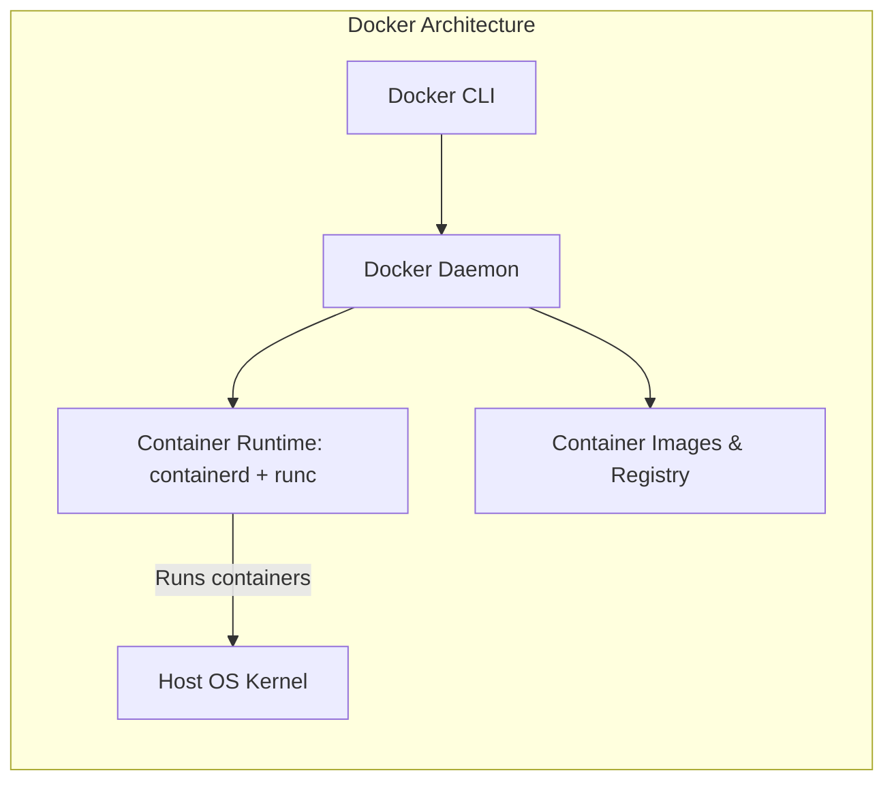
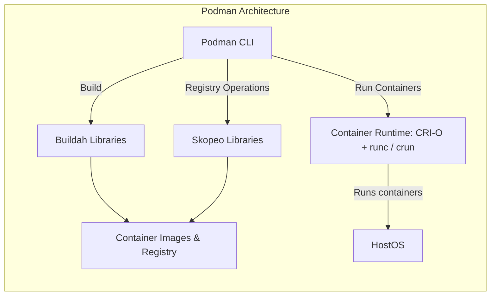

Introduction
===

What is Containerization?

- Lightweight virtualization method
- Isolate applications and their dependencies/runtimes
- Ensure portability across multiple systems
  - Only container runtime is required

<!-- end_slide -->

Containerization Methods
===

<!-- column_layout: [1, 1] -->
<!-- column: 0 -->

# Kinds of Containers

- LXC/LXD
  - "System containers" that behave like virtual machines
  - Contains full OS including init system (e.g. systemd)
  - Used by e.g. Proxmox and Incus
- Kata Containers
  - Promise: Security of VM, speed of containers
  - Uses one kernel per container
  - Runs inside a micro-VM
  - Integrates with orchestration tools like Docker or Kubernetes
- Open Container Initiative (OCI) Containers
  - Vendor-neutral container standard
  - Defines how image is packaged
  - Defines container lifecycle (create, start, stop)

<!-- column: 1 -->
<!-- pause -->

# This lecture

We will focus on **OCI Containers**

Tools supporting OCI runtime or image specification:

- Runtimes: runc, crun, Kata
  - Lowest level, ensure isolation, start and stop container processes
- Engines: Docker/Podman, containerd, CRI-O
  - User facing interface
  - Utilize runtime to manage containers
  - Provide CLI and API to do so
- Orchestration: Kubernetes (k8s)
  - Schedule containers across multiple machine
  - Scaling, self-healing, rolling updates
<!-- pause -->
- Fun fact: Nix can build OCI images

<!-- end_slide -->
OCI Principles
===

TODO

- Image building
- Registries
- Entrypoints/CMD
- Containers
- Pods
- Namespacing/IPC/NetNS
- Volumes
- Secrets?

<!-- end_slide -->

Docker vs Podman: Summary
===

<!-- column_layout: [1, 5, 1] -->
<!-- column: 1 -->
| Feature      | Docker                   | Podman                        |
| ------------ | ------------------------ | ----------------------------- |
| Architecture | Client/Server            | Daemonless                    |
| Permissions  | Rootfull by default      | Rootless by default           |
| Daemon       | Yes, always running      | Optional (Docker API support) |
| Runtime      | Containerd / runc        | CRI-O / crun                  |
| Pods (k8s)   | Not natively             | Native support                |
| IaC          | docker-compose           | compose, quadlet, k8s         |
| Network      | ⚠️ Overwrites `iptables` | Rootless: Userspace (also has drawbacks) |
|              |                          | Rootfull: limited changes to `iptables`  |

<!-- pause -->
In general, Podman can be used as a Docker replacement: `alias docker=podman`
<!-- pause -->
Of course there are differences when comparing rootless against rootfull
<!-- pause -->
This lecture uses Podman as default -> `alias podman=docker` if you have Docker installed

<!-- end_slide -->

Docker vs Podman: Architecture
===

<!-- column_layout: [2, 3] -->
<!-- column: 0 -->

<!-- column: 1 -->

<!-- end_slide -->
Registries & Tags
===

<!-- column_layout: [1, 1] -->
<!-- column: 0 -->
## Registries:

- DockerHub (docker.io)
- Quay (quay.io)
- GitHub Container Registry (ghcr.io)
- Kubernetes Container Registry (registry.k8s.io)
- GitLab/Forgejo: Usually same domain as git instance

<!-- column: 1 -->
## Tags

- Like git tag, depend on project
- Ideally: Multiple SemVer releases, e.g. version `1.2.3`, `1.2` and `1` refer to the same tag
  - Tags can also contain distros: `python:3.14`, `python:3.14-alpine`, `python:3.14-alpine3.23`
  - Implicit tag is always `latest`. Tags like `latest`, `stable`, `dev`, ... can exist but agaib depend on project

TODO: Don't simply use latest

Which baseos?
- ubuntu/fedora
- debian (`-slim`)
- alpine
- distroless
- scratch

<!-- end_slide -->
Building Container Images
===

- FROM, COPY (--chown), RUN, CMD, ENTRYPOINT, EXPOSE, ENV, ARG

- podman built . -t mytag [-f MyContainerfile]
- --build-arg

- Files can be named Dockerfile or Containerfile

<!-- end_slide -->
Running Containers
===

`podman` and `docker` are interchangieable (for the most part)

`podman run`: Subcommand to run containers

`podman run [--rm] [-it] [--entrypoint <myentrypoint>] mycontainer <command>`

- `-v`/`--volumes`: Attach volumes or volume mounts: `-v ./my-local-folder:/mnt/folder-in-container:ro,Z`
  - Add `:ro` for read-only volumes, `Z` or `z` for SELinux context
  - SELinux: `container_file_t` label
  - `z` for shared volumes, `Z` if only container is allowed to write
- `--publish, -p=[[ip:][hostPort]:]containerPort[/protocol]`
  - Publish a port, e.g. -p `8080:80` to map 80 in container to 8080 on host

- Network modes: Host
- Firewall (rootless vs rootfull)

<!-- end_slide -->
Exercise
===

Your task is to create two simple container images, one running hello world both in C and Python:

<!-- column_layout: [1, 1] -->
<!-- column: 0 -->
# Python

- Create a file `hello_world.py`
- Use a simple Python image to run the file
  - You don't need to build an image, just modify the volume mount and command

<!-- column: 1 -->
# C

- Create `hello_world.c` and a second Containerfile
- Start with a debian image (docker.io/debian:slim)
- Install the build tools
- Compile the C file and run it
- Does it work?

<!-- pause -->
- Do you think this is a good solution?
<!-- pause -->
  - No! We want to reduce the overhead!

<!-- end_slide -->
Multi staging
===

Idea: Fewer stuff in image
- Scratch/distroless/alpine
- `podman build --target`
  - Allow dev and prod image in a single file
<!-- end_slide -->
Running as different user
===

- useradd (no standard)
- `USER`
- subuid mapping in rootless mode
- podman unshare
- `/etc/sub{u,g}id`
- map userns
- or: `idmap` volume option

<!-- end_slide -->

Thank you for your attention!

Don't forget the feedback
