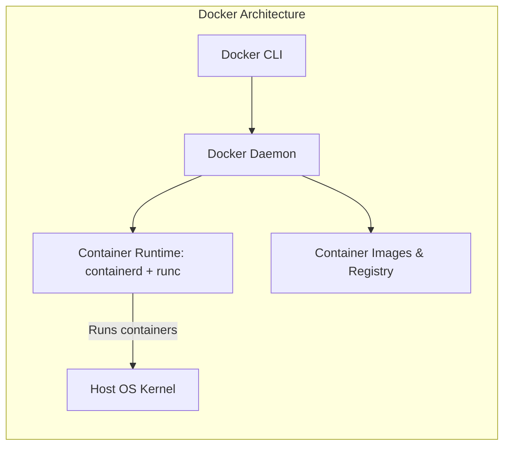
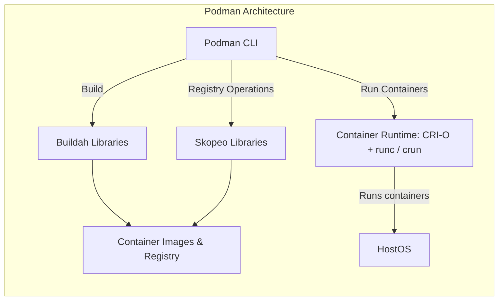

Introduction
===

What is Containerization?

- Lightweight virtualization method
- Isolate applications and their dependencies/runtimes
- Ensure portability across multiple systems
  - Only container runtime is required

<!-- end_slide -->

Containerization Methods
===

<!-- column_layout: [1, 1] -->
<!-- column: 0 -->

# Kinds of Containers

- LXC/LXD
  - "System containers" that behave like virtual machines
  - Contains full OS including init system (e.g. systemd)
  - Used by e.g. Proxmox and Incus
- Kata Containers
  - Promise: Security of VM, speed of containers
  - Uses one kernel per container
  - Runs inside a micro-VM
  - Integrates with orchestration tools like Docker or Kubernetes
- Open Container Initiative (OCI) Containers
  - Vendor-neutral container standard
  - Defines how image is packaged
  - Defines container lifecycle (create, start, stop)

<!-- column: 1 -->
<!-- pause -->

# This lecture

We will focus on **OCI Containers**

Tools supporting OCI runtime or image specification:

- Runtimes: runc, crun, Kata
  - Lowest level, ensure isolation, start and stop container processes
- Engines: Docker/Podman, containerd, CRI-O
  - User facing interface
  - Utilize runtime to manage containers
  - Provide CLI and API to do so
- Orchestration: Kubernetes (k8s)
  - Schedule containers across multiple machine
  - Scaling, self-healing, rolling updates
<!-- pause -->
- Fun fact: Nix can build OCI images

<!-- end_slide -->
OCI Principles
===

TODO

- Image building
- Registries
- Entrypoints/CMD
- Containers
- Pods
- Namespacing/IPC/NetNS

<!-- end_slide -->

Docker vs Podman: Summary
===

| Feature      | Docker              | Podman                        |
| ------------ | ------------------- | ----------------------------- |
| Architecture | Client/Server       | Daemonless                    |
| Permissions  | Rootfull by default | Rootless by default           |
| Daemon       | Yes, always running | Optional (Docker API support) |
| Runtime      | Containerd / runc   | CRI-O / crun                  |
| Pods (k8s)   | Not natively        | Native support                |
| IaC          | docker-compose      | compose, quadlet, k8s         |

<!-- end_slide -->

Docker vs Podman: Architecture
===

<!-- column_layout: [2, 3] -->
<!-- column: 0 -->

<!-- column: 1 -->

<!-- end_slide -->

Thank you for your attention!

Don't forget the feedback
