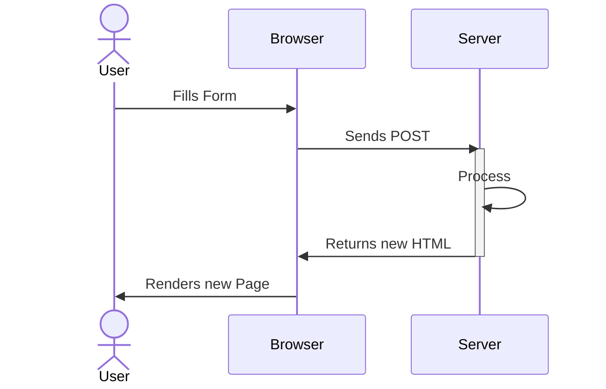
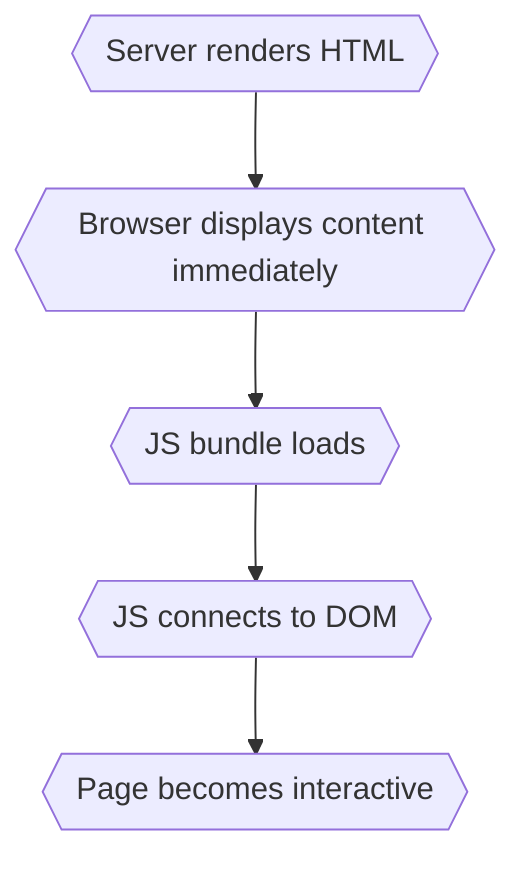
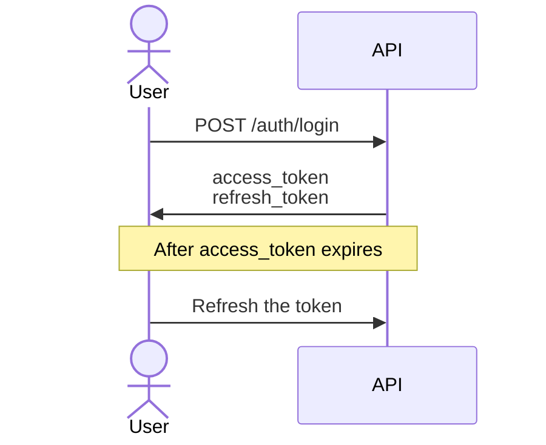

Web Application Structure
===
<!-- column_layout: [2,3] -->
<!-- column: 0 -->

# Traditional Web Applications

- Browser ⇄ Server ⇄ Database
- Server Side Rendering (SSR)
  - No **J**ava**S**cript (JS) required
  - Example: PHP, Django
- Full page reload every time
- State lives on server session
- Limited interactivity
  - Hard to support mobile apps
- UI tightly coupled to backend
- Modernization: jQuery, alpine.js, HTMX

<!-- column: 1 -->



---
Web Application Structure
===

<!-- column_layout: [1,1] -->
<!-- column: 0 -->
# Modern SPA Architecture

- SPA = **S**ingle **P**age **A**pplication
- Initial HTML loads once
  - Afterwards: Dynamic updates using JS
- Frontend framework handles "routing"
  - Often using page anchor (`https://my.app/#/mypage`)
- Stateless API calls
- Often Token-based auth (JWT, OAuth)
- Decoupled frontend/backend
  - Often different development teams

<!-- column: 1 -->
<!-- pause -->
# New Problems
- **S**earch **E**ngine **O**ptimization (SEO) issues
- Slow first page load
  - Large JS bundles
  - More client-side computation
- Complex state management
  - More state on client, but only server state is really persistent
- API overfetching

---
Web Application Structure
===

<!-- column_layout: [1,1] -->
<!-- column: 0 -->
# Modern Full-Stack Frameworks

- Combine SSR with interactivity
- Examples: Next.js/Nuxt/Remix/SvelteKit
- Enables Hydration
  - Fast first paint
  - Rich interactivity

**Advantages**:
- SEO-friendly
- Fast initial load
- API routes built-in
- Reduced boilerplate
- Shared types

<!-- column: 1 -->
# Hydration Flow


---
API Styles
===

<!-- column_layout: [1,1] -->
<!-- column: 0 -->
# What is an API Style?

An API style defines:

- How clients communicate
- How data is structured
- How operations are modeled
- How contracts are defined

<!-- column: 1 -->
# Why This Matters

Architecture decisions here:

- affect scalability
- affect performance
- affect developer experience
- live for years

<!-- pause -->
<!-- reset_layout -->

## Today

REST (main focus) | GraphQL | gRPC | WebSockets | SOAP (briefly)

---
REST
===

**Re**presentational **S**tate **T**ransfer

Architectural style defined by Roy Fielding

⚠️ Not just "HTTP + JSON"

> https://roy.gbiv.com/pubs/dissertation/fielding_dissertation.pdf

<!-- pause -->

Further reading (more descriptive):

> O'Reilly REST API Design Rulebook

<!-- pause -->

---
REST Constraints
===

True REST requires:

1. Client–Server
2. Stateless
3. Cacheable
4. Uniform Interface
5. Layered System
6. (Optional) Code on Demand

If you break these -> HTTP API, not REST.

---
HTTP Methods
===

| Method  | Description                                           | Safe | Idempotent | Cacheable |
|---------|-------------------------------------------------------|------|------------|-----------|
| HEAD    | Same as GET but returns headers only (no body).       | Yes  | Yes        | Yes       |
| OPTIONS | Returns supported HTTP methods for a resource (CORS). | Yes  | Yes        | No        |
| GET     | Retrieves data from the server without modifying it.  | Yes  | Yes        | Yes       |
| POST    | Sends data to the server to create a new resource.    | No   | No         | Yes       |
| PUT     | Replaces an existing resource with new data.          | No   | Yes        | No        |
| PATCH   | Partially updates an existing resource.               | No   | No         | Depends   |
| DELETE  | Removes a resource from the server.                   | No   | Yes        | No        |
| TRACE   | Performs a message loop-back test for diagnostics.    | Yes  | Yes        | No        |
| CONNECT | Establishes a tunnel to the server (often for HTTPS). | No   | No         | No        |

> https://developer.mozilla.org/en-US/docs/Web/HTTP/Reference/Methods

---
Uniform Interface
===

In REST HTTP verbs have meaning.

- GET     → safe, idempotent
- POST    → create (or run controller)
- PUT     → replace
- PATCH   → partial update
- DELETE  → idempotent delete

**CRUD** = **C**reate (POST) **R**ead (GET) **U**pdate (PUT/PATCH) **D**elete (DELETE)

⚠️ not just GET/POST as traditional HTML forms

---
Resource-Oriented Design
===

Resources are nouns. Nouns are always in plural form.
<!-- column_layout: [1,1] -->
<!-- column: 0 -->
## Good:

GET /orders/123

POST /orders

DELETE /orders/123

<!-- column: 1 -->
### Bad:

POST /createOrder

POST /deleteOrder

---
Naming Conventions
===

# Identifiers
- Use singular nouns for identifiers: `GET /users/philipp`
- Use some other kind of identifier (not noun):
  - `/users/1337`
  - `/users/cafe1234-coff-ee00-bean-123456789abc`
<!-- pause -->
# Collections and Controllers
- Use plural nouns for collections: `GET /users`
- Use verbs for controllers: `POST /emails/42/resend`

---
URI Structure
===

Longer paths separated by `/` indicate a hierarchical relationship

`https://api.example.com/electronics/computers/laptops`

<!-- pause -->

Use hyphens for more readable URLs, avoid underscores

`https://api.example.com/philipp/lectures/introduction-to-linux/`

<!-- pause -->

Use lowercase letters and avoid file extensions

E.g. `Content-type: application/json` header instead of api.example.com/users.json

---
Query Design
===

<!-- column_layout: [1,1] -->
<!-- column: 0 -->
# Filtering

Queries can be used to filter certain resources:

- `GET /users` returns all users
- `GET /users?firstname=Philipp` filters the users by first name

# Pagination

Our APIs often serve lots of data. Use pagination for more responsiveness:

- `GET /students?pageSize=50&page=3`

<!-- column: 1 -->
<!-- pause -->
# Partial Responses
- Imagine a user selection field
- We send a `GET /users` request
- Now we get all Users
  - First name/Last name
  - Date of birth
  - Address & Email
- But we only need name and ID!

⚠️ Overfetching

<!-- pause -->
Up to own implementation, e.g.

`GET /users?fields=id,name`

---
HTTP Status Codes
===

<!-- column_layout: [1,1] -->
<!-- column: 0 -->
# Status Codes Matter!

Q: Which status codes do you know?

<!-- pause -->
Not just 200 or 500
- Clients want to rely on status codes
<!-- pause -->
**Never** return 200 with content like
```json +no_background
{"error": "Unexected error"}
```
<!-- column: 1 -->
<!-- pause -->

| Status | Description        |
|--------|--------------------|
| 200    | OK                 |
| 201    | Created            |
| 204    | No Content         |
| 400    | Bad Request        |
| 401    | Unauthorized       |
| 403    | Forbidden          |
| 404    | Not Found          |
| 405    | Method Not Allowed |
| 409    | Conflict           |
| 418    | I'm a teapot       |

<!-- reset_layout -->
> https://developer.mozilla.org/en-US/docs/Web/HTTP/Reference/Status

---
Authentication
===
<!-- column_layout: [1,1] -->
<!-- column: 0 -->

REST uses token based authentication

- Authenticate against API (Username/Password)
- Or use identity provider (OAuth)
- User retrieves token(s)
  - Access + Refresh token is possible
  - Can be string-token or JWT
- Authenticate against API

```bash +no_background
GET /api/data
Authorization: Bearer <access_token>
```

<!-- column: 1 -->


---
REST Attributes
===

<!-- column_layout: [1,1] -->
<!-- column: 0 -->
# Statelessness
Each request contains:

- Authentication
- Context
- All required data

Server stores no client session.

Benefits:

- Horizontal scaling
- Simpler infrastructure

<!-- column: 1 -->
# Maturity Model after Richardson

| Level   | Description       |
| ------- | ----------------- |
| Level 0 | HTTP as transport |
| Level 1 | Resources         |
| Level 2 | HTTP verbs        |
| Level 3 | Hypermedia        |


Most APIs stop at Level 2

---

# HATEOAS

**H**ypermedia **A**s **T**he **E**ngine **O**f **A**pplication **S**tate

Example response:

```json +no_background
{
  "id": 123,
  "status": "shipped",
  "_links": {
    "self": "/orders/123",
    "cancel": "/orders/123/cancel"
  }
}
```

Almost nobody fully implements this...
<!-- pause -->
Though e.g. AWX gets pretty close

---
Versioning Strategies
===
<!-- column_layout: [1,1] -->
<!-- column: 0 -->

# Why should we use versioning?

<!-- incremental_lists: true -->
- APIs evolve
- Clients stay static or lack behind
  - Web Apps can be distributed together
  - What if "old" SPA contact new backend?
    - Page reload required
  - What about native clients?
- How can old and new clients use the same API?
<!-- incremental_lists: false -->

<!-- column: 1 -->
<!-- pause -->
# Common approaches

- URI versioning:
  - api.example.com/v1/orders
  - v1.example.com/orders
<!-- pause -->
- Header versioning
  - `Header: "X-API-Version: 1"`
<!-- pause -->
- Content negotiation
  - `Accept: application/vnd.company.v1+json`

<!-- pause -->
<!-- reset_layout -->
> Pragmatism > purity.

---
OpenAPI
===
<!-- column_layout: [1,1] -->
<!-- column: 0 -->

# What

Machine-readable REST contract.

Describes:

- Endpoints
- Schemas
- Authentication
- Responses

YAML or JSON.
<!-- pause -->
> All JSON is valid YAML

<!-- column: 1 -->
<!-- pause -->
# Why

Enables:

- Client code generation
- Server stub generation
- Mock servers
- Documentation
- Contract-first development

Single source of truth.

---
OpenAPI Code Generation
===

<!-- column_layout: [1,1] -->
<!-- column: 0 -->
# Which direction
From one spec we can generate:

- API Clients/SDKs
- Server Stubs

The spec can also be generated!

<!-- column: 1 -->
# Which version
- OpenAPI v2 ("Swagger")
- OpenAPI v3.X
- Be as modern as possible :)
  - Limitation: Codegen Tooling
<!-- reset_layout -->
- See e.g. FastAPI/Django REST Framework
  - Also available for every other relevant language/framework

---
OpenAPI Codegen Tools
===

<!-- column_layout: [1,1] -->
<!-- column: 0 -->
# Viewers

Can be bundled with your application or used standalone to view the OpenAPI spec

- [Swagger UI](https://github.com/swagger-api/swagger-ui)
- [Swagger Editor](https://editor.swagger.io)
- [Redoc](https://github.com/Redocly/redoc)
- [Stoplight Tools](https://github.com/stoplightio)

<!-- pause -->
# Mock Servers

Generate static responses (no logic)

- [PRISM](https://github.com/stoplightio/prism)

<!-- column: 1 -->
<!-- pause -->
# Generators
[OpenAPI Generator](https://openapi-generator.tech)
- Most popular
- Clients/Servers/Docs

<!-- pause -->
[Swagger Codegen](https://swagger.io/tools/swagger-codegen)
- "Original" OpenAPI codegen tool
- Less maintenance, not community driven

<!-- pause -->
[AutoRest](https://github.com/Azure/autorest)
- From Microsoft, Azure SDK Style

<!-- pause -->
And more depending on Language/Framework

---
Events
===

REST APIs are focused on HTTP Polling

Use GET or HEAD to retrieve resource

But what if we want to get notified by the server?

---
WebSockets
===

- Persistent connection – Stays open, unlike HTTP request/response.
- Bidirectional – Server can push data anytime; client can send anytime.
- Low latency – Ideal for real-time apps.
- Protocol – Starts as HTTP/HTTPS handshake, then “upgrades” to WebSocket.

<!-- column_layout: [2,3] -->
<!-- column: 0 -->
1. Client opens socket
```perl +no_background
wss://example.com/socket
```
<!-- column: 1 -->
2. Server sends message when required
```json +no_background
{ "type": "message", "content": "Hello!" }
```

---
Other API Types
===

brief summary
===

---
GraphQL
===
<!-- column_layout: [1,1] -->
<!-- column: 0 -->
# Different philosophy

Single endpoint/method:
- `POST /graphql`

Client defines the shape of the response

Supports subscriptions -> Push Events

<!-- column: 1 -->
# Characteristics

- Strongly typed schema
- No overfetching
- No underfetching
- Typically no versioning
- Evolving schema

---
GraphQL Example
===

<!-- column_layout: [1,2] -->
<!-- column: 0 -->
Example Query body:

```graphql +line_numbers +no_background
query {
    order(id: 123) {
        id
        status
        items {
            name
            price
        }
    }
}
```
<!-- column: 1 -->

Client controls data selection -> Like SQL for the frontend
- Avoids complicated backend logic when filtering/joining data
- Avoids overfetching of data

---
GraphQL Contract
===

<!-- column_layout: [1,1] -->
<!-- column: 0 -->
Schema Definition Language (SDL):

```graphql +no_background
type Order {
    id: ID!
    status: String!
}
```
<!-- column: 1 -->
From schema you can generate:

- Typed clients
- Models/Interfaces for different programming languages

Very strong tooling ecosystem.

<!-- pause -->
<!-- reset_layout -->
Low effort to try out! For Postgres: Try `pg_graphql` / `graphile` / `hasura`
- Instantly make your database a GraphQL server
  - ⚠️ Only expose the tables you want, don't leak data!

---
gRPC
===

- High-Performance Remote Procedure Call (RPC) interface
- Protocol Buffers (Protobuf) – compact binary serialization format
- HTTP/2 – supports multiplexing, bidirectional streaming, and low latency
- Strongly typed contracts via `.proto` files

```protobuf +no_background
service UserService {
    rpc GetUser (UserRequest) returns (UserResponse);
}
```

<!-- pause -->
- More for Server-Side API queries
- Browsers need gRPC-Web (cannot open raw HTTP/2 streams)
- `.proto` files can be used for codegen

---
SOAP (Simple Object Access Protocol)
===

- XML-based protocol. Not just HTTP; can run over SMTP, TCP, etc
- Uses WSDL (Web Services Description Language) contracts
- Uses RPCs based on dynamic XML content:

```xml +no_background +line_numbers
<soap:Envelope xmlns:soap="http://www.w3.org/2003/05/soap-envelope">
  <soap:Header>
    <!-- Optional metadata -->
  </soap:Header>
  <soap:Body>
    <m:GetUser xmlns:m="http://example.com/users">
      <m:UserId>123</m:UserId>
    </m:GetUser>
  </soap:Body>
</soap:Envelope>
```

- TL;DR: Not as simple as the name implies, rather complex and bloated

---
TL;DR
===
<!-- column_layout: [1,1,1] -->
<!-- column: 0 -->
Use REST when:

- Public APIs
- External consumers
- Simplicity matters
- Browser-first

<!-- column: 1 -->
Use GraphQL when:

- Many frontend variants
- Complex data graphs
- Avoiding overfetching is critical

<!-- column: 2 -->
Use gRPC when:

- Internal microservices
- Performance critical
- Strong contracts required

<!-- reset_layout -->
<!-- pause -->
Use SOAP when: The application already exists, and you don't have a choice

---
Thank you for your attention!
===
Don't forget the feedback
===
